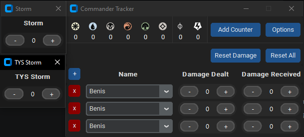

# Commander Tracker

A lightweight tracker for EDH / Commander games using a simple desktop GUI.

## Features
* Track mana, experience and poison.
* Track damage dealt by and received from up to 10 players.
* Create custom counters as needed. 
* Store names of friends and regular players.

## Shortcuts
* Left-click adds to a mana counter
* Right-click subtracts from a mana counter
* Shift + Left-click resets mana counter to 0
* Ctrl + Left-click resets all mana counters to 0



---

## Requirements

* Python 3.11+ recommended

Python packages used:
* customtkinter
* CTkSpinbox
* tksvg

---

## Installation

1. Clone the repository
    ```bash
    git clone <repo-url>
    cd Commander_Tracker
    ```
2. Create a virtual environment:
    **Linux**
    ```bash
    python -m venv .venv
    source .venv/bin/activate
    ```

    **Windows (Git Bash)**
    ```bash
    python -m venv .venv
    source .venv/Scripts/activate
    ```

    **Windows (PowerShell)**
    ```powershell
    python -m venv .venv
    .venv\Scripts\Activate.ps1
    ```
3. Install dependencies:
    ```bash
    pip install -r requirements.txt
    ```
---

## Running the Application
```bash
python main.py
```
---

## Building the Executable
The project uses PyInstaller.

Build with `pyinstaller main.py --onefile -w --collect-all="tksvg"`, or run `build.bat`

The executable will be created in `dist/Commander_Tracker.exe`